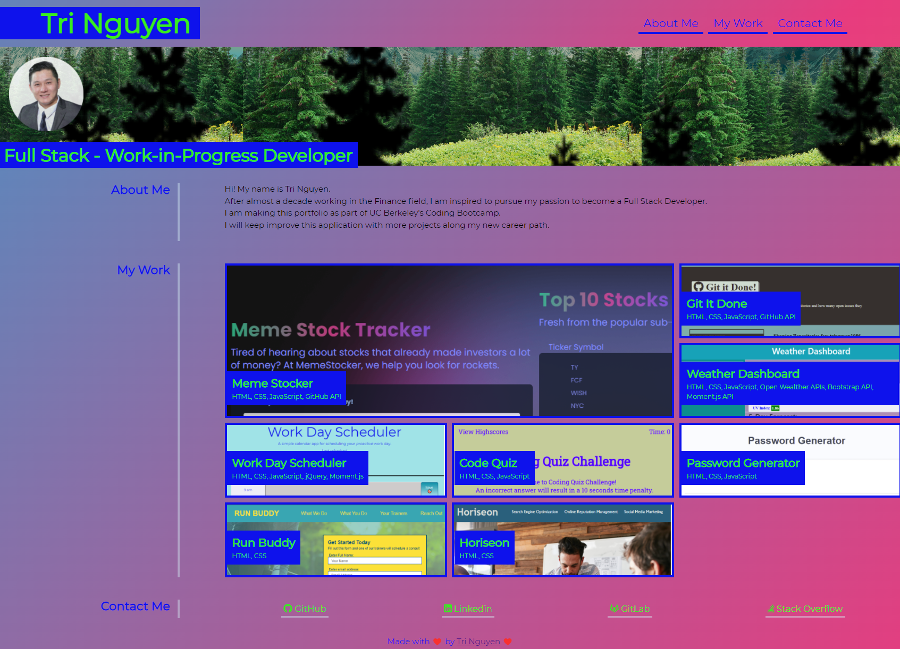

# Welcome to My Portfolio!!!

## Live Application Link

[professional-portfolio](https://tringuyen1086.github.io/professional-portfolio-tri-nguyen/)

## Project Visual

## UC Berkeley Fullstack Coding Bootcamp

This porfolio is a work in progress that shows activities, homework, and projects for UC Berkeley Coding Boot Camp. 
I will add more links, styles, and codes to improve my portfolio over time.

## Currently working with:

* [x] API
* [x] Bootstrap
* [x] CSS
* [x] DOM
* [x] GitBash
* [x] GitLab
* [x] GitHub
* [x] Html
* [x] JavaScript
* [x] JQuery
* [x] JSon
* [x] MVC Pardigm
* [x] Node JS
* [x] VS Code
* [x] ...
* [x] and more on the way

## Assignments (In Progress)

* [x] [horiseon](https://tringuyen1086.github.io/horiseon)
* [x] [run-buddy](https://tringuyen1086.github.io/run-buddy/)
* [x] [password-generator](https://tringuyen1086.github.io/password-generator-ultimate/)
* [x] [code-quiz](https://tringuyen1086.github.io/code-quiz-basis/)
* [x] [work-scheduler](https://tringuyen1086.github.io/work-scheduler-ultimate/)
* [x] [weather-dashboard](https://tringuyen1086.github.io/weather-dashboard-ultimate/)
* [x] [git-it-done](https://tringuyen1086.github.io/git-it-done-ultimate/)
* [x] [meme-stocker](https://tringuyen1086.github.io/meme-stocker/)

## Code snipit 

This particular code is how I used ccs with my html to create an animated banner on my portfolio.

  background-color: rgba(12, 219, 174, 0.4);
  background-image:   
    url('https://78.media.tumblr.com/cae86e76225a25b17332dfc9cf8b1121/tumblr_p7n8kqHMuD1uy4lhuo1_540.png'), 
    url('https://78.media.tumblr.com/66445d34fe560351d474af69ef3f2fb0/tumblr_p7n908E1Jb1uy4lhuo1_1280.png'),
    url('https://78.media.tumblr.com/8cd0a12b7d9d5ba2c7d26f42c25de99f/tumblr_p7n8kqHMuD1uy4lhuo2_1280.png'),
    url('https://78.media.tumblr.com/5ecb41b654f4e8878f59445b948ede50/tumblr_p7n8on19cV1uy4lhuo1_1280.png'),
    url('https://78.media.tumblr.com/28bd9a2522fbf8981d680317ccbf4282/tumblr_p7n8kqHMuD1uy4lhuo3_1280.png');
  background-size: cover;
  background-repeat: repeat-x;
  background-position: 
    0 20%,
    0 100%,
    0 50%,
    0 100%,
    0 0;
  background-size: 
    2500px,
    800px,
    500px 200px,
    1000px,
    400px 260px;
  animation: 50s para infinite linear;
  }

@keyframes para {
  100% {
    background-position: 
      -5000px 20%,
      -800px 95%,
      500px 50%,
      1000px 100%,
      400px 0;
    }

This particular code is how I used ccs with my html to create a changing color background.

background: linear-gradient(-45deg, #ee7752, #e73c7e, #23a6d5, #23d5ab);
    background-size: 400% 400%;
    animation: gradient 15s ease infinite;
}

@keyframes gradient {
    0% {
        background-position: 0% 50%;
    }
    50% {
        background-position: 100% 50%;
    }
    100% {
        background-position: 0% 50%;
    }

## Contributing

* [x] [Tri Nguyen](https://tringuyen1086.github.io/professional-portfolio-tri-nguyen/)
* [x] Please find me on [Linkedin](https://www.linkedin.com/in/tri-nguyen-1086).

